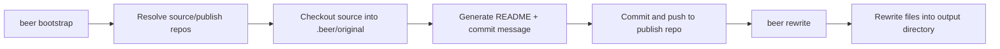

# HoldMyBeer

HoldMyBeer is a TypeScript CLI for bootstrapping and rewriting codebases with a minimal, composable workflow.

It is organized as a single workspace package at `packages/holdmybeer`, with the `beer` CLI as the primary interface.

## What It Does

- Bootstraps source and publish repositories
- Detects available AI providers (for example `claude`, `codex`)
- Generates an initial project `README.md`
- Generates an Angular-style initial commit message
- Pushes the initialized project to GitHub
- Rewrites a source codebase into a clean output directory

## Workflow



## Quick Start

### Requirements

- Node.js 22+
- Yarn 1.x
- GitHub CLI (`gh`) authenticated (`gh auth login`)

### Install

```bash
yarn install
```

### Bootstrap (interactive)

```bash
yarn bootstrap
```

### Rewrite

```bash
yarn rewrite ./fixtures/dev-source --dry-run
```

Or use the built-in example shortcut:

```bash
yarn dev:run
```

## CLI Commands

| Command | Purpose |
| --- | --- |
| `beer bootstrap` | Initialize `.beer` settings, source/publish repos, generated README, and first push |
| `beer rewrite <sourceDir>` | Rewrite a source tree into an output directory |

Useful rewrite options:

- `-o, --output <dir>` set output directory
- `--force` overwrite existing output directory
- `--dry-run` compute rewrite without writing files
- `-i, --include <glob>` include filter (repeatable)
- `-x, --exclude <glob>` exclude filter (repeatable)
- `--report <path>` write JSON report

## Repository Layout

```text
packages/holdmybeer/
  sources/
    ai/          # README + commit message generation
    bootstrap/   # bootstrap workflow
    commands/    # CLI commands
    context/     # runtime context
    github/      # GitHub integration
    rewrite/     # rewrite engine
    text/        # user-facing text catalog
    util/        # shared utilities
```

## Development Scripts

- `yarn build` build package output
- `yarn dev` run CLI in dev mode
- `yarn bootstrap` run `beer bootstrap`
- `yarn rewrite` run `beer rewrite`
- `yarn test` run vitest suites
- `yarn typecheck` run TypeScript checks
