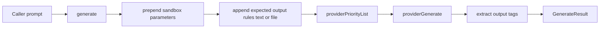

# AI Generate Function

Updated `generate` to shape prompts with explicit sandbox context and explicit output expectations.

## Flow

## Notes

- `generate` now prepends current sandbox details (`read-only` or `write-whitelist`).
- `generate` appends expected output instructions (`text` or `file`).
- `expectedOutput` defaults to `text` when omitted.
- `generate` delegates provider invocation to `providerGenerate`.
