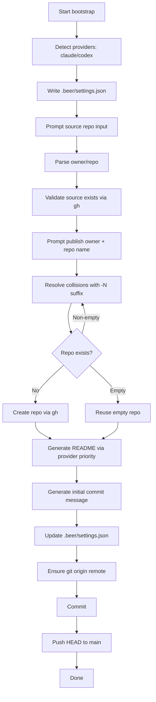

# Bootstrap Flow

This document describes the initial `daycare bootstrap` workflow used by holdmybeer.

## Sequence

## Notes

- Source repository input accepts URL, SSH remote, or `owner/repo` shorthand.
- Publish repo defaults to `<source>-holdmybeer` and auto-suffixes when a non-empty repo already exists.
- Existing empty repository names are accepted and reused.
- README/commit generation tries provider priority first, then uses deterministic fallback text.
