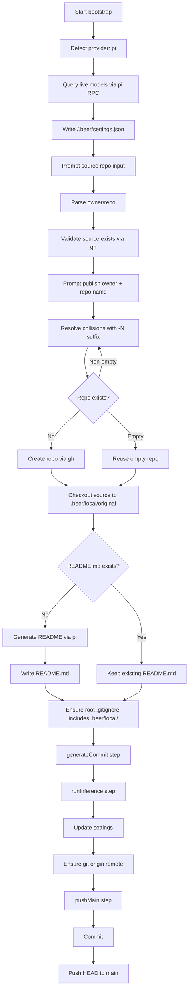

# Bootstrap Flow

This document describes the bootstrap workflow selected from `beer`.

## Sequence

## Notes

- Source input accepts URL, SSH remote, or `owner/repo` shorthand.
- Publish repo defaults to `<source>-holdmybeer` and auto-suffixes on non-empty collisions.
- Source is checked out to `<projectPath>/.beer/local/original` before inference.
- Bootstrap skips README inference when `README.md` already exists.
- Bootstrap creates/updates root `.gitignore` in the README phase before the first commit.
- README and commit generation resolve workflow model priorities against live `pi` model availability.
- Inference failures fail the operation.
