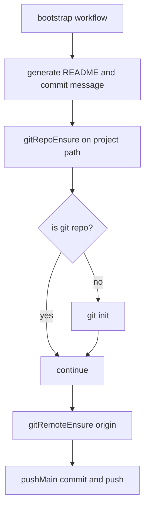

# Bootstrap Git Repo Init

Bootstrap now ensures the target project directory is an initialized git repository before configuring remotes and pushing.

## Flow

## Notes

- Added `sources/modules/git/gitRepoEnsure.ts`.
- Bootstrap calls `gitRepoEnsure` before remote setup.
- Prevents `fatal: not a git repository` during bootstrap push flow.
