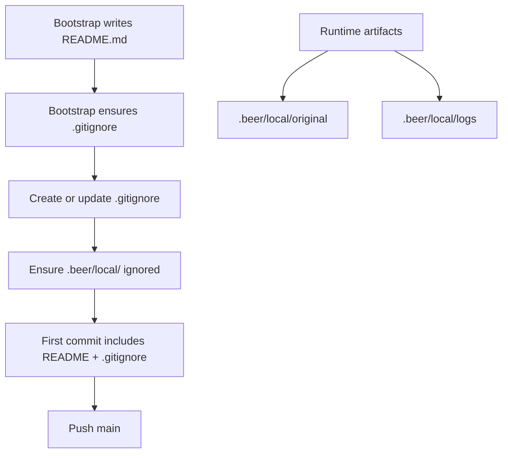

# Bootstrap local runtime artifacts and gitignore

Bootstrap now guarantees a root `.gitignore` exists and includes `.beer/local/` during README materialization, before the first commit.

All local-only runtime artifacts are grouped under `.beer/local/`:
- Source checkout: `.beer/local/original`
- Log files: `.beer/local/logs/beer-YYYY-MM-DD.log`

