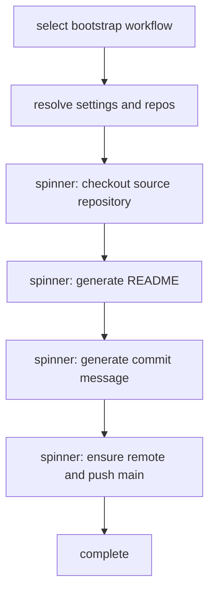

# Bootstrap Screen Progress

Bootstrap now renders user-visible single-character progress while long operations run, so workflow execution is visible even when logs are file-only.

## Flow

## Notes

- Progress is rendered with `stepProgressStart` and appears on screen only.
- Detailed logs remain in `.beer/logs/beer-YYYY-MM-DD.log`.
