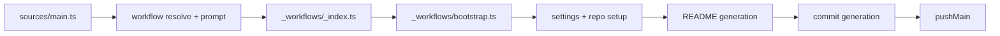

# Bootstrap Workflow Log Removal

Removed workflow-level logging from the bootstrap orchestration.

## Flow

## Notes

- `bootstrap` no longer calls `beerLog`.
- Functional behavior of bootstrap steps remains unchanged.
