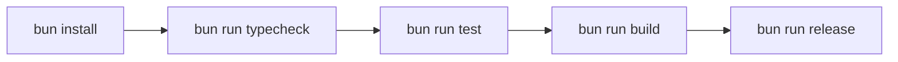

# Bun Migration

The repository tooling has been migrated from Yarn scripts to Bun.

## Flow

## Changes

- Root `package.json` now uses `packageManager: bun@1.3.6`.
- Root workspace scripts now use `bun --workspaces run ...`.
- Package scripts now run entrypoints with Bun (`bun sources/...`).
- Release runner now executes install/test/build using Bun commands.
- User-facing docs and release error hint now reference Bun commands.
