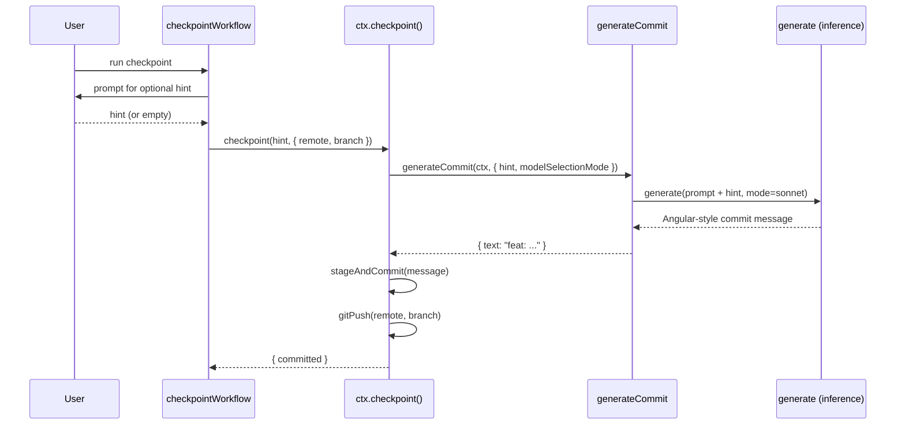

# Checkpoint Commit Message Inference

`ctx.checkpoint()` uses AI inference to generate Angular-style commit messages from an optional user hint.

## Flow

## Model Selection

`ctx.checkpoint()` defaults to `sonnet` model selection mode. Callers can override via `options.modelSelectionMode` (e.g. bootstrap uses `codex-high`).

## Prompt

The commit message prompt asks for a single-line Angular-style commit message. When the caller provides a hint, it is included as `Context: {hint}`. When no hint is given, the context defaults to `"checkpoint of current changes"`.
