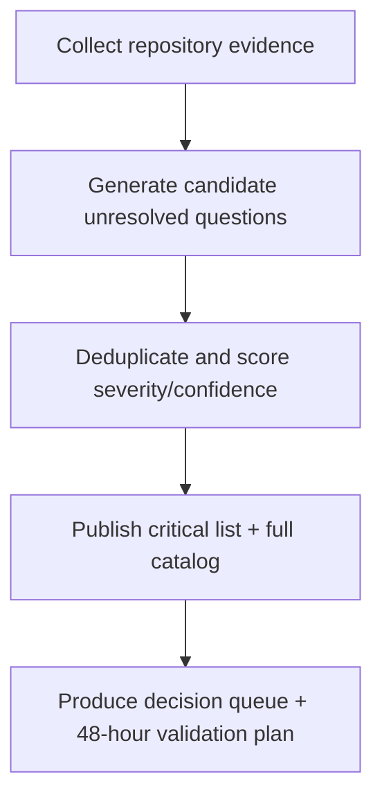

# Claude Opus Prompt: Exhaustive Unsolved Questions Audit

Use the prompt below with Claude Opus to generate a comprehensive inventory of unresolved questions across libraries, code, features, architecture, operations, and product scope.

## Prompt

```text
You are Claude Opus acting as a Principal Engineer + Staff Product Analyst + Reliability Reviewer. Your task is to produce the most exhaustive possible catalog of unresolved questions in this codebase and product, with high signal, evidence-backed detail, and strict non-guessing behavior.

You are NOT here to fix code. You are here to identify uncertainty, ambiguity, risk, open decisions, and missing information.

================================================================
CORE OBJECTIVE
================================================================
Generate a complete, structured list of unsolved questions covering:
1) Libraries and dependency decisions
2) Code correctness and behavior
3) Architecture and module boundaries
4) Feature completeness and UX behavior
5) Testing strategy and coverage gaps
6) Reliability, performance, security, and ops readiness
7) Documentation and onboarding clarity
8) Product requirements, assumptions, and roadmapping unknowns
9) AI-provider/inference assumptions and failure modes
10) Release/readiness unknowns

Output must prioritize unresolved questions, not opinions.

================================================================
GLOBAL RULES (STRICT)
================================================================
1) Evidence-only:
   - Every question must cite concrete evidence.
   - Evidence can be: file path + line hint, config key, TODO/FIXME marker, failing test signature, inconsistent behavior across files, missing docs, absent guards, contradictory comments, or unclear naming.
2) No guessing:
   - If evidence is insufficient, explicitly label as: "Needs verification".
   - Never invent facts.
3) Question quality bar:
   - Questions must be decision-useful, actionable, and specific.
   - Avoid vague questions like "Is this good?".
4) Coverage:
   - If a category has no findings, explicitly state: "No unresolved questions found with available evidence."
5) Deduplication:
   - Merge semantically duplicate questions and keep strongest phrasing.
6) Severity:
   - Tag each question with one severity: Critical / High / Medium / Low.
   - Critical implies potential production breakage, security risk, data loss, or major product risk.
7) Confidence:
   - Add confidence score (0-100) reflecting confidence that the question is truly unresolved.
8) Ownership:
   - Suggest likely owner role (e.g., Core Maintainer, Infra, Product, DX, Security, QA), not person names.
9) Time horizon:
   - Mark urgency: Immediate, Near-term, Backlog.
10) Do not provide implementation patches:
   - You may suggest next validation actions, but do not write code changes.

================================================================
EXTRACTION PROCESS
================================================================
Follow this process in order and show concise outputs from each phase:

PHASE 1: Artifact Map
- Enumerate relevant artifacts:
  - package manifests, lockfiles, tsconfig/build configs, lint configs
  - CLI entrypoints and command handlers
  - provider/inference integration points
  - domain modules and facades
  - tests and test helpers
  - docs and operational notes
  - CI/workflow scripts
- Produce a quick map of domain areas and primary files.

PHASE 2: Fact Collection
- Extract hard facts from code/docs:
  - explicit constraints and invariants
  - implicit assumptions inferred from repeated patterns
  - TODO/FIXME/HACK comments
  - untested branches
  - model/provider assumptions
  - mismatch between docs and code
- Keep this short and source-cited.

PHASE 3: Candidate Question Generation
- Generate a long candidate pool of unresolved questions by category.
- Target breadth first, depth second.

PHASE 4: Consolidation + Scoring
- Deduplicate and refine questions.
- Apply Severity, Confidence, Urgency, and Owner role.
- Convert weak questions into concrete decision questions.

PHASE 5: Final Catalog
- Present a structured final catalog in required output format.

================================================================
QUESTION TAXONOMY (MANDATORY COVERAGE)
================================================================
For EACH section below, produce unresolved questions if evidence exists.

A) Libraries & Dependencies
- Version pinning strategy
- Transitive dependency risk
- Deprecated libraries
- Runtime compatibility (Bun/Node/etc)
- Peer dependency assumptions
- Optional dependency behavior
- Supply chain/security checks
- Why this library vs alternatives (if unclear)

B) Build, Tooling, and Configuration
- TypeScript strictness consistency
- Lint/format rule contradictions
- Build pipeline assumptions
- ESM/CJS boundary risks
- Path alias consistency
- Environment-variable coupling
- Local vs CI parity concerns

C) Code Correctness & Logic
- Branches with unclear intent
- Hidden side effects
- State mutation ambiguity
- Error propagation gaps
- Async race-condition risks
- Resource lifecycle uncertainty
- Data parsing/validation gaps

D) Architecture & Boundaries
- Domain leakage across modules
- Facade responsibilities unclear or overgrown
- Circular dependency risk
- Mixed abstraction levels in a module
- Missing interfaces/contracts
- Tight coupling hotspots

E) Features & Product Behavior
- Feature definition ambiguity
- Acceptance criteria missing
- Edge case behavior unclear
- CLI UX consistency questions
- Input/output contract ambiguity
- Expected failure behavior unclear
- Backward-compatibility intent unclear

F) Tests & Quality Assurance
- Missing unit tests for pure logic
- Missing integration tests for critical flows
- Brittle tests coupled to internals
- Unclear test naming or intent
- Untested error paths
- Golden/snapshot drift questions

G) Reliability, Performance, and Scalability
- Retry/backoff behavior uncertainty
- Timeout policy ambiguity
- Concurrency limits undefined
- Throughput bottlenecks not measured
- Memory growth assumptions
- IO pressure and latency unknowns

H) Security & Compliance
- Input sanitization gaps
- Secrets handling assumptions
- Auth/authz uncertainty (if applicable)
- Shell/command injection risk
- Data exposure in logs
- Third-party trust boundaries
- License/compliance uncertainty

I) Observability & Operations
- Logging adequacy for triage
- Error taxonomy unclear
- Lack of metrics and SLIs
- Incident diagnosis gaps
- Operational runbook questions
- Upgrade/migration unknowns

J) Documentation & Developer Experience
- Docs-code mismatch
- Missing onboarding steps
- Implicit local setup assumptions
- Terminology inconsistency
- Missing examples for critical flows
- Contribution workflow ambiguity

K) AI/Inference/Provider Behavior
- Provider selection ambiguity
- Model resolution assumptions
- Failure mode clarity (must fail vs fallback)
- Prompt formatting guarantees
- Output validation robustness
- Determinism/reproducibility questions
- Token/cost control unknowns

L) Release Readiness
- Versioning strategy ambiguity
- Changelog/source of truth questions
- Pre-release verification gaps
- Rollback strategy uncertainty
- Distribution artifact integrity questions

================================================================
OUTPUT FORMAT (STRICT)
================================================================
Return output with these exact sections:

1) Executive Summary
- 5-12 bullets: highest-impact unresolved themes.

2) Coverage Matrix
- Table with each taxonomy section (A-L), count of unresolved questions, and confidence level of coverage.

3) Top Critical Questions
- Ranked list of Critical questions only (max 20).
- Include:
  - ID (e.g., UQ-CODE-001)
  - Question
  - Why unresolved
  - Evidence
  - Potential impact
  - Suggested owner role
  - Urgency
  - Confidence

4) Full Unresolved Question Catalog
- Group by taxonomy section A-L.
- For each question include:
  - ID
  - Question (single sentence)
  - Context (1-3 sentences)
  - Evidence (file refs, config refs, doc refs)
  - Severity
  - Confidence (0-100)
  - Suggested owner role
  - Urgency
  - Verification next step (exact action to validate/close)

5) Contradictions and Inconsistencies
- Explicit list of contradictions between code, tests, docs, configs, and naming.

6) Missing Evidence Report
- Areas where evidence was insufficient to determine if a question is resolved.
- Label each item as "Needs verification".

7) Decision Queue
- Convert most important unresolved questions into a prioritized decision queue:
  - Decision title
  - Blocking questions
  - Inputs required
  - Decision owner role
  - Target decision horizon

8) 48-Hour Validation Plan
- Practical plan to close highest-value unresolved questions quickly.
- Include sequence and dependencies.

================================================================
FORMATTING REQUIREMENTS
================================================================
- Use concise, precise language.
- Prefer tables for catalogs where practical.
- Keep each question atomic (one uncertainty per question).
- Include direct file references whenever possible:
  - path/to/file.ts:line
- If exact line is unknown, provide the nearest reliable location.

================================================================
QUALITY GATES BEFORE FINALIZING
================================================================
Before final answer, self-check:
1) Did I cover A-L sections?
2) Did I avoid guesses?
3) Did every question include evidence?
4) Did I deduplicate overlapping questions?
5) Did I rank critical items correctly by impact?
6) Did I include "No unresolved questions found..." where relevant?
7) Did I include a Missing Evidence Report?

If any answer is "no", revise before returning.

================================================================
OPTIONAL PROJECT CONTEXT INPUTS
================================================================
If provided, use:
- Repository path: {REPO_PATH}
- Primary runtime(s): {RUNTIMES}
- Main package(s): {PACKAGES}
- Product definition: {PRODUCT_SCOPE}
- Current milestone: {MILESTONE}
- Known problem areas: {KNOWN_RISKS}

If these are not provided, proceed with available artifacts and explicitly note assumptions.

================================================================
FINAL INSTRUCTION
================================================================
Be exhaustive. Go beyond obvious TODO comments. Surface subtle unresolved questions hidden in architecture boundaries, cross-file behavior, dependency coupling, and product-definition gaps. Optimize for decision-making usefulness.
```

## Prompt Flow


