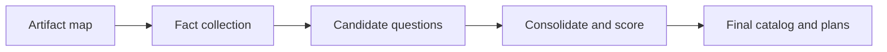

# Claude Opus Unsolved Questions Prompt Summary

This summary describes the large prompt in `doc/claude-opus-unsolved-questions-prompt.md`.

## Purpose

The prompt instructs Claude Opus to perform an exhaustive unresolved-questions audit of a repository and product scope. It is designed to find open questions across libraries, code behavior, features, testing, security, operations, docs, and release readiness.

## What It Produces

- A ranked list of critical unresolved questions.
- A full catalog of unresolved questions grouped by taxonomy.
- Evidence-backed entries with file references.
- Severity, confidence, urgency, and owner-role tags for each item.
- Contradictions report (code/docs/config/tests mismatches).
- Missing evidence report for uncertain areas.
- A prioritized decision queue.
- A 48-hour validation plan to close high-value unknowns.

## Prompt Design Highlights

- Enforces evidence-only findings.
- Prohibits guessing and invented facts.
- Requires full taxonomy coverage (A-L).
- Forces deduplication and scoring.
- Optimizes for decision usefulness, not code patching.

## Taxonomy Coverage

The prompt requires mandatory analysis of:

1. Libraries & dependencies
2. Build/tooling/configuration
3. Code correctness & logic
4. Architecture & boundaries
5. Features & product behavior
6. Tests & QA
7. Reliability/performance/scalability
8. Security & compliance
9. Observability & operations
10. Documentation & DX
11. AI/provider/inference behavior
12. Release readiness

## Execution Model

## Practical Use

Use the full prompt when you want a comprehensive decision backlog of unknowns before refactoring, shipping, or planning roadmap work.
