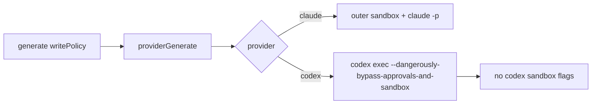

# Codex Provider Fix

Adjusted Codex inference execution to avoid nested sandbox transport failures.

## Flow

## Notes

- Codex now runs without codex-native sandbox flags.
- Claude still uses outer sandbox wrapping.
- macOS deny list no longer blocks `.config/gh` or `Library/Keychains` reads.
