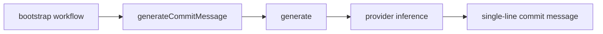

# Commit Message Workflow Step

Moved commit message generation from AI module to workflow step.

## Flow

## Notes

- New location: `sources/workflows/steps/generateCommitMessage.ts`
- Old module file removed: `sources/modules/ai/aiCommitMessageGenerate.ts`
- `bootstrap` now imports workflow step directly.
