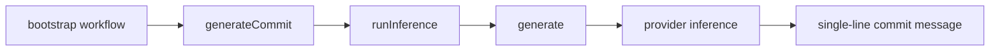

# Commit Workflow Step

Commit message generation now runs through workflow steps with global context.

## Flow

## Notes

- Current location: `sources/workflows/steps/generateCommit.ts`
- Prompt placeholders resolve via `runInference` handlebars support.
- `bootstrap` imports `generateCommit` directly.
