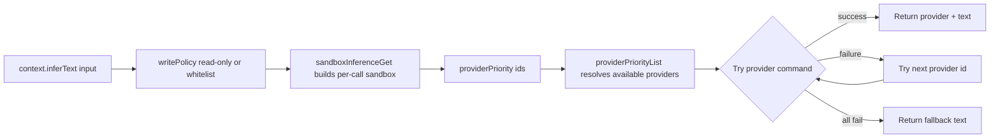

# Context Inference Flow

The CLI now initializes a global `Context` object once before command execution.

## Initialization

```mermaid
flowchart TD
  A[beer command starts] --> B[contextInitialize]
  B --> C[providerDetect probes claude/codex]
  C --> D[Create Context { providers, inferText }]
  D --> E[Store in globalThis.Context]
  E --> F[Command handlers use Context]
```

## Inference Routing



## Notes

- Inference now takes typed provider ids (`"claude" | "codex"`) per call.
- Provider fallback order is controlled by the explicit `providerPriority` array.
- Per-call visibility is supported with `showProgress: true` on `inferText`.
- `inferText` always runs sandboxed and always uses yolo provider mode (`--dangerously-skip-permissions`).
- `inferText` supports `writePolicy` for either read-only mode or write-whitelist mode.
- Bootstrap persists detected providers to `~/Developer/HoldMyBeerDev/.beer/settings.json`, but inference no longer uses settings order directly.
