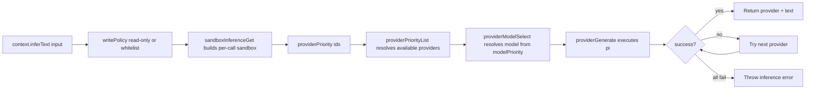

# Context Inference Flow

The CLI initializes a global `Context` once, then routes all inference through `pi`.

## Initialization

```mermaid
flowchart TD
  A[beer command starts] --> B[contextInitialize]
  B --> C[providerDetect probes pi]
  C --> D[providerModelsGet via pi RPC]
  D --> E[Create Context { providers, inferText }]
  E --> F[Store in globalThis.Context]
```

## Inference Routing



## Notes

- Inference now uses provider id type `"pi"`.
- Provider retry order is controlled by `providerPriority`.
- Model choice is controlled by `modelPriority` and cross-checked against live models.
- Inference is fail-fast with no fallback content.
