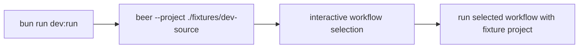

# Dev Run Command

The repository now includes a predefined dev command:

- `bun run dev:run`

It runs the `beer` CLI from a fixed fixture project path.

## Paths

- Source fixture: `fixtures/dev-source`
