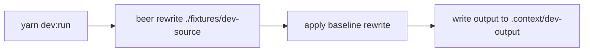

# Dev Run Command

The repository now includes a predefined dev command:

- `yarn dev:run`

It runs the `beer` CLI rewrite flow against a fixed fixture source folder.

## Paths

- Source fixture: `fixtures/dev-source`
- Output folder: `.context/dev-output`
