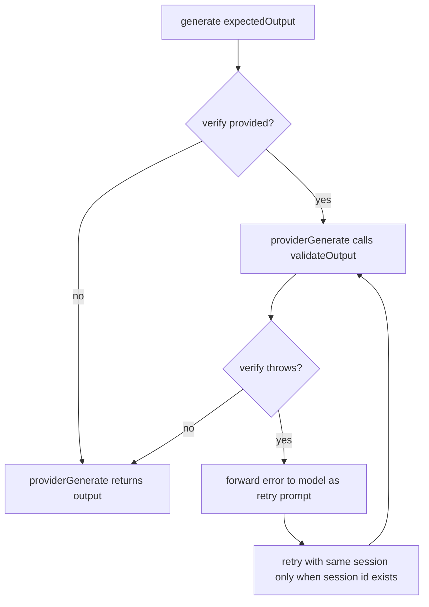

# Expected Output Verify Hook

Added optional `verify` callbacks to `generate` expected output types for both text and file modes.

## Flow

## Notes

- `expectedOutput.type = text` supports `verify({ text })`.
- `expectedOutput.type = file` supports `verify({ text, filePath, fileContent })`.
- `verify` may be synchronous or asynchronous.
- Verification retry count defaults to `10`.
- Verification failures are returned to the model as an error prompt; retry uses the same provider session only when a session id is available.
