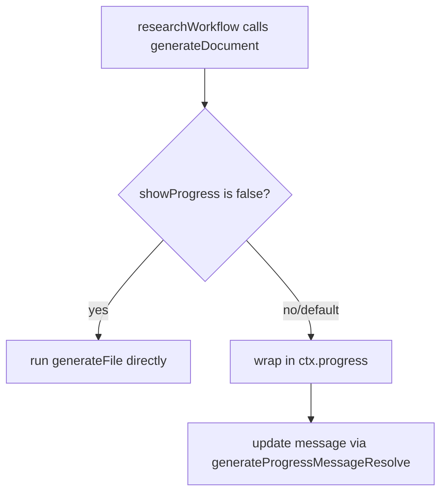

Document generation now renders workflow progress by default, so research runs no longer execute silently after workflow selection.

## Flow

## Notes

- `generateDocument(...)` now defaults to progress-on unless explicitly disabled.
- `showProgress: false` still bypasses spinner wrapping for non-interactive or nested flows.
