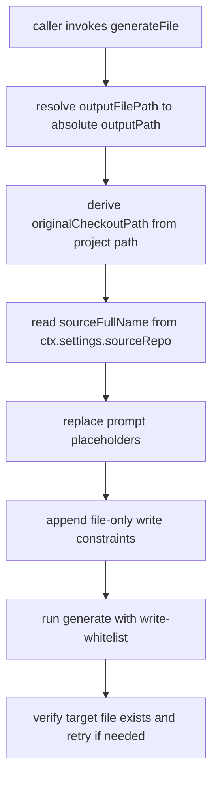

# GenerateFile Standard Variables

`generateFile` now injects standard prompt template variables internally before running inference.

## Flow

## Standard Variables

- `{outputPath}`: absolute path of the file being generated.
- `{originalCheckoutPath}`: `<project>/.beer/local/original`.
- `{sourceFullName}`: source repository full name when configured in settings.
