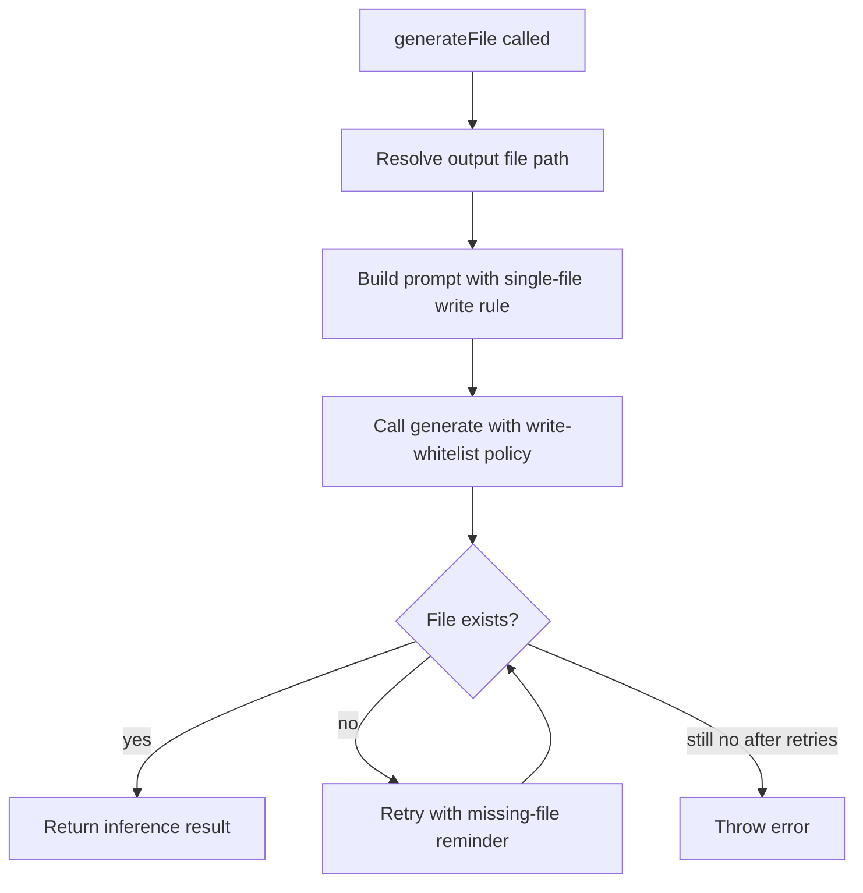

# Generate File

Added `generateFile` to drive inference that should write to exactly one file.

## Flow

## Rules

- Prompt explicitly says to write only to one file.
- Sandbox `writePolicy` whitelists only that file path.
- Retries if inference completed but file did not appear.
