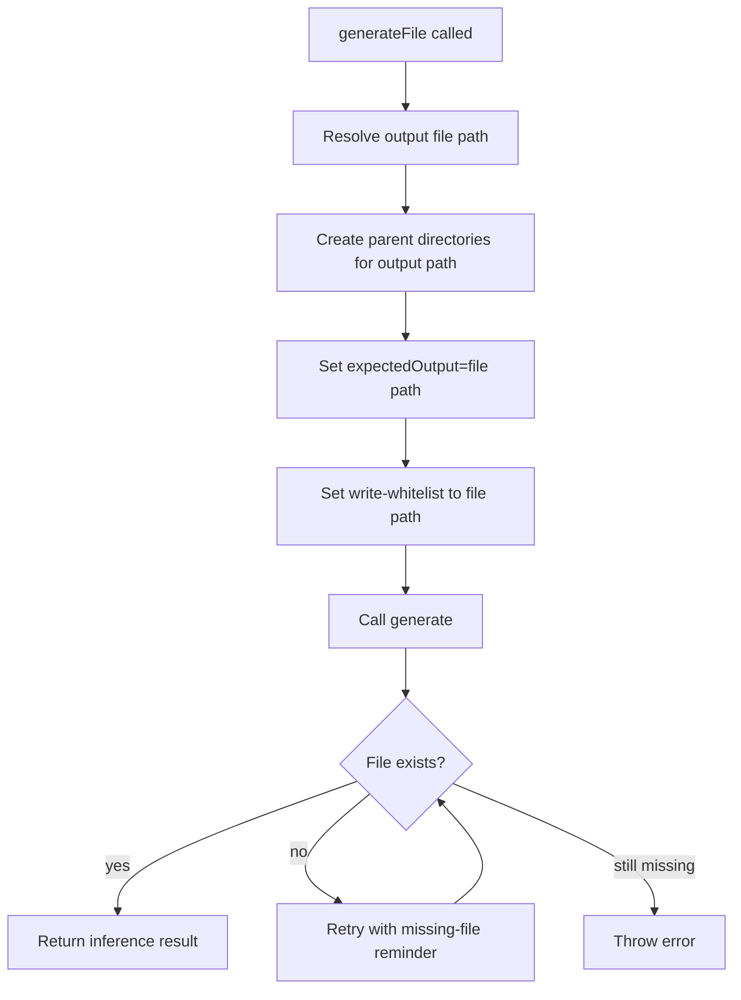

# Generate File

`generateFile` now forces file-output mode through `generate` permissions.

## Flow

## Rules

- `generateFile` creates parent directories for the target path before inference starts.
- `expectedOutput` is forced to `type=file` for the target file.
- `writePolicy` is forced to `write-whitelist` for the same file.
- Prompt still reiterates single-file write constraints.
- In file mode, `<output>` tags are not required from provider stdout.
