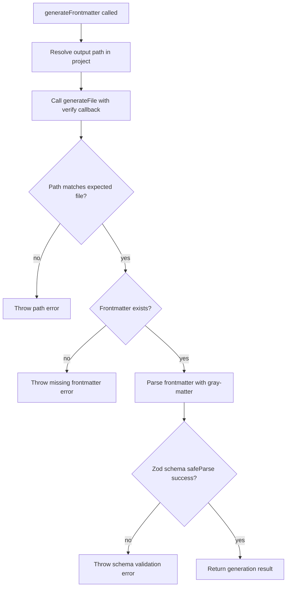

# Generate Frontmatter

`generateFrontmatter` adds schema-verified frontmatter generation for workflow steps that write markdown-like files.

## Flow

## Rules

- Frontmatter is required for the generated file.
- Frontmatter must be parsed via `gray-matter`.
- Frontmatter data must pass the caller-provided Zod schema.
- Validation failures throw and fail the workflow step.
