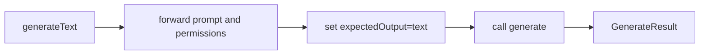

# Generate Text

Restored `generateText` as a shortcut wrapper around `generate`.

## Flow

## Notes

- `generateText` intentionally constrains `expectedOutput` to `text`.
- Caller-supplied provider/write policies still pass through.
