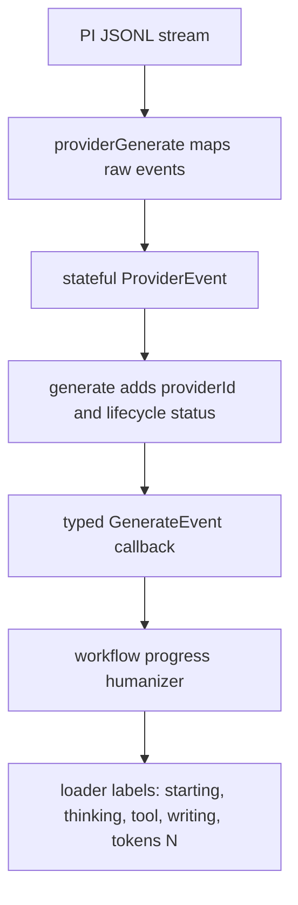

# Generate Typed Events

`generate` now emits structured `GenerateEvent` objects instead of string tokens.

## Flow

## Event Model

- Stream events are stateful:
  - `thinking` events carry the full current thinking text on each update.
  - `tool_call` events carry the current tool name and current arguments/partial JSON.
  - `text` events carry the full current assistant text for that text block.
- Token usage is reported as numbers:
  - `usage` events carry `input`, `output`, `cacheRead`, `cacheWrite`, and `total`.
  - `provider_status` with `status=completed` also includes final token totals when available.
- No string-based event parsing remains in workflow progress code.
