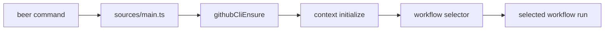

# GitHub CLI Launcher Check

GitHub CLI validation now runs in the CLI launcher before workflow selection.

## Flow

## Notes

- `githubCliEnsure` was removed from `bootstrapWorkflow`.
- The precheck now fails fast before any workflow prompt is shown.
