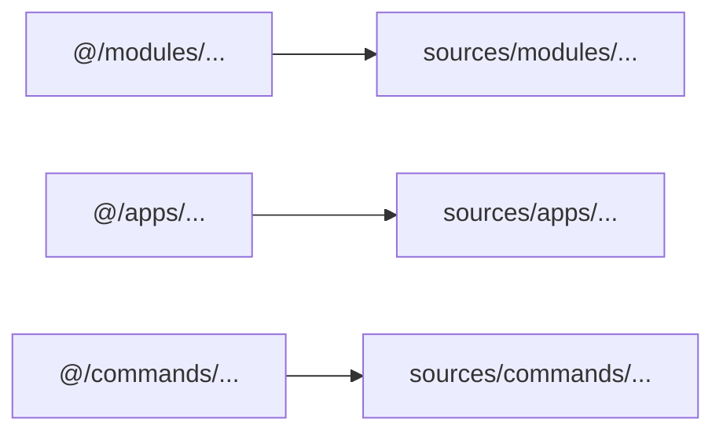

# Import Alias Update

Internal source imports now use the `@/` alias instead of relative paths.

## Resolution

- Updated `sources/**/*.ts` imports from relative paths to `@/...`.
- Added `@/* -> ./sources/*` in TypeScript paths.
- Added Vitest alias resolution for `@/`.
