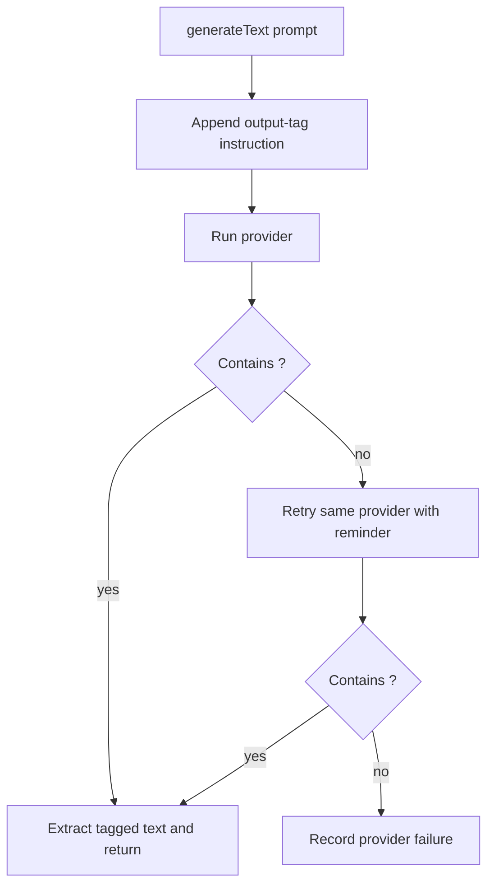

# Inference Output Tags

Inference prompts now require providers to return the final text inside `<output>...</output>` tags.

## Flow

## Retry Reminder

When tagged output is missing, the retry appends:

`Last time you didnt return <output> - do this now`
