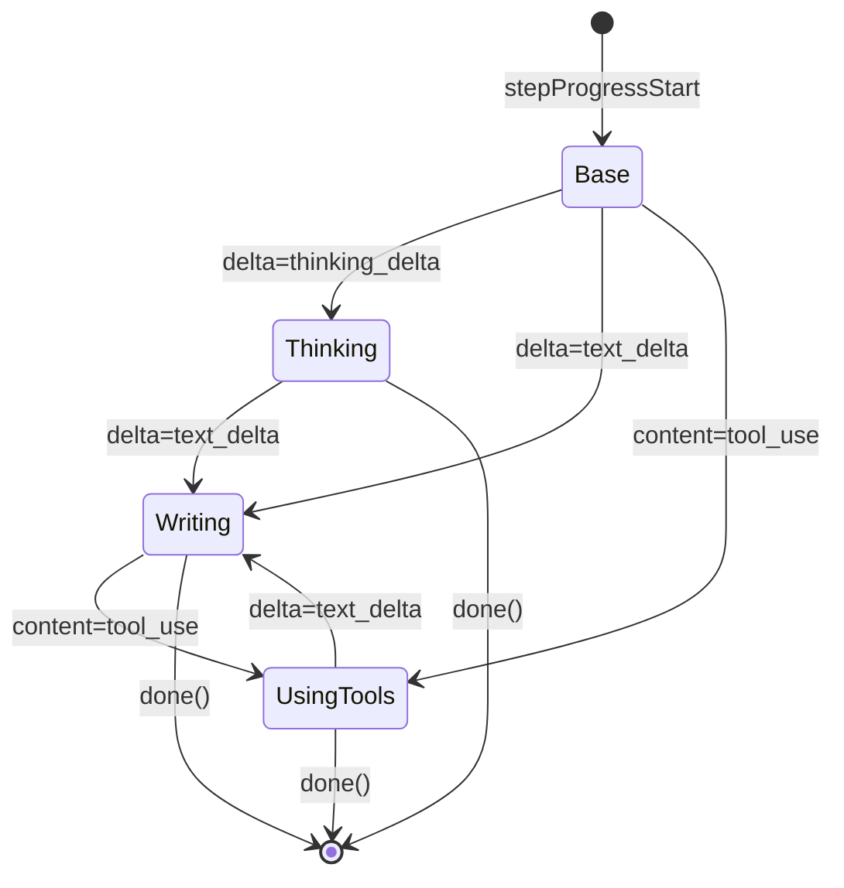

# Inference progress: user-friendly labels

## Problem

The spinner during inference showed raw SSE protocol events like
"PI assistant message started", "PI text streaming", "PI turn started".
These are internal implementation details, not meaningful to users.

## Solution

Replaced verbose protocol-level event mapping with simple content-level labels:

- `content_block_delta delta=thinking_delta` → "thinking"
- `content_block_delta delta=text_delta` → "writing"
- `content_block_start content=tool_use` → "using tools"
- `content_block_delta delta=input_json_delta` → "using tools"
- `content_block_start content=text` → "writing"

All other events (turn start/end, message start/end, selected, started,
completed, model, stderr, exit codes) are suppressed — the spinner keeps
its last meaningful label until the next content event or completion.

## Spinner examples

```
/ Generating README.md
/ Generating README.md (thinking)
/ Generating README.md (writing)
* Generating README.md
```



## Files changed

- `sources/_workflows/steps/runInference.ts` — simplified humanize functions
- `sources/_workflows/steps/runInference.spec.ts` — updated tests
