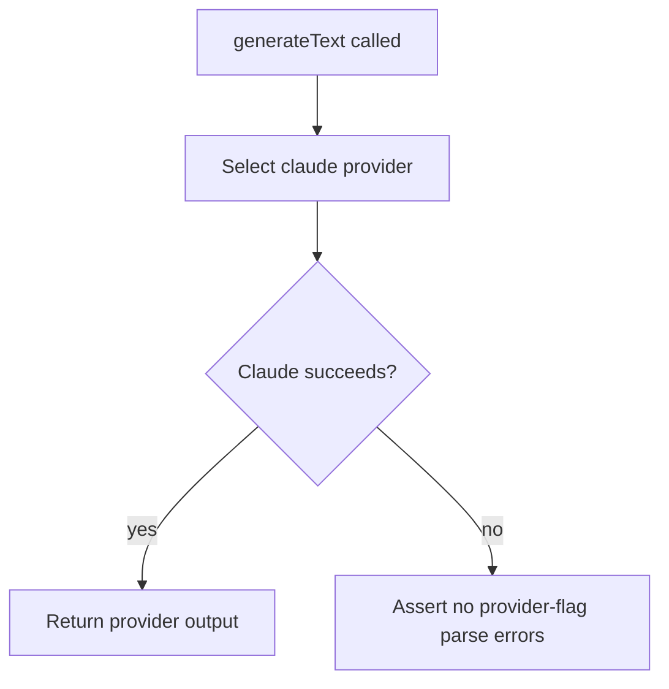

# Inference Provider Tests

Added provider-specific inference tests that run real Claude and Codex CLIs (no mocks).

## Flow

## Coverage

- Claude execution validates `--dangerously-skip-permissions` is accepted by the real CLI.
- Codex execution validates `--dangerously-bypass-approvals-and-sandbox` is accepted by the real CLI.
