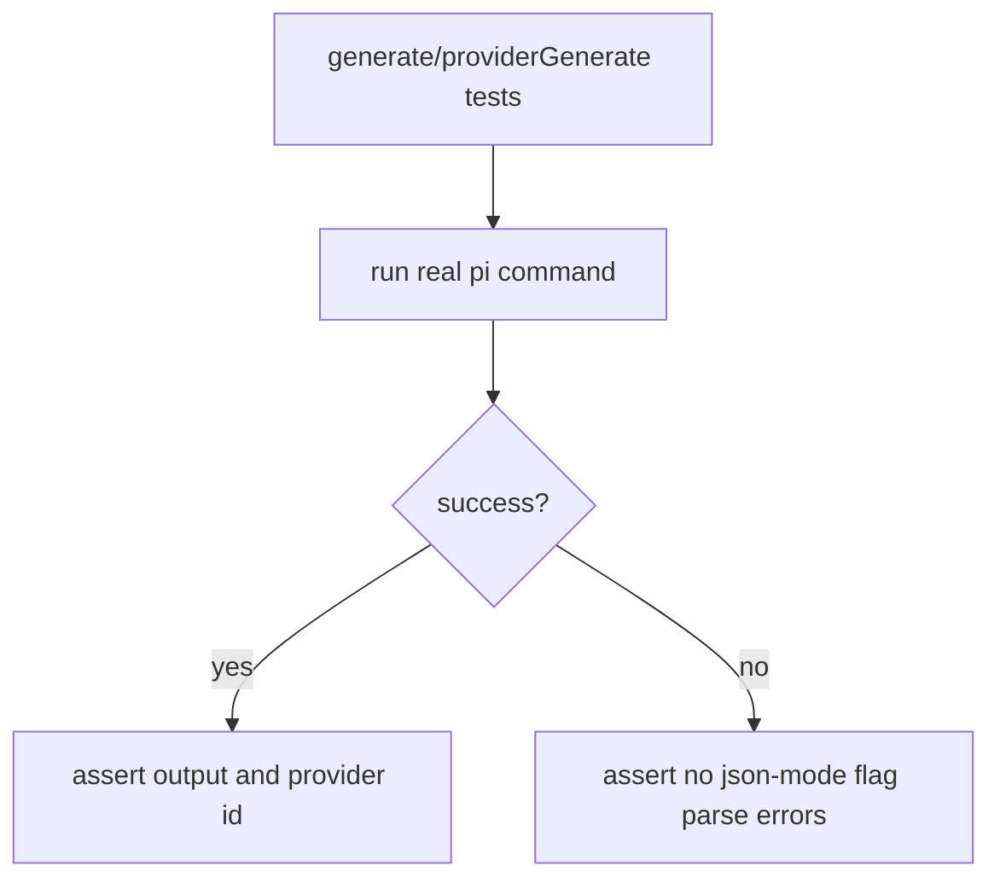

# Inference Provider Tests

Inference integration tests now validate real `pi` CLI execution (no mocks).

## Flow

## Coverage

- `generate.spec.ts` validates end-to-end `generate()` execution through `pi`.
- `providerGenerate.spec.ts` validates read-only and single-file write-whitelist modes.
- Failure assertions verify errors are not caused by unsupported `pi` flags.
