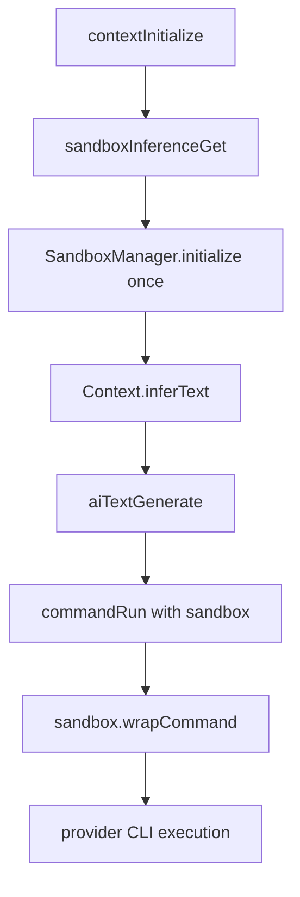

# Inference Sandbox

Inference commands now execute inside a shared sandbox instance created once at context initialization.

## Policy

- Library: `@anthropic-ai/sandbox-runtime` (latest)
- Network: always allowed via sandbox ask callback (`host -> allow`)
- Filesystem writes: only project directory
- `.beer` subtree: explicitly denied for writes (read-only)

## Sequence

## Notes

- The sandbox is reused across all `inferText` calls.
- Read-only inference prompt guard is still applied before provider invocation.
- Provider-specific read-only flags are still used (`--tools ""`, `--sandbox read-only`).
