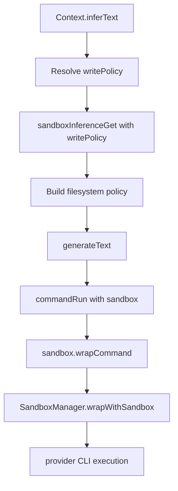

# Inference Sandbox

Inference commands now execute inside a per-call sandbox policy created at `inferText` time.

## Policy

- Library: `@anthropic-ai/sandbox-runtime` (latest)
- Network: unrestricted by sandbox (no `network` section configured)
- Filesystem writes are dynamic per inference call:
  - `read-only` mode: no writable paths
  - `write-whitelist` mode: only explicitly listed files/paths are writable
- Provider auth state is always writable:
  - `~/.claude`
  - `~/.codex`
- Sensitive host paths are denied for both read and write (same baseline as Daycare sandbox policy)

## Sequence

## Notes

- Inference always runs in sandbox.
- Provider CLIs are invoked in yolo mode (Claude: `--dangerously-skip-permissions`, Codex: `--dangerously-bypass-approvals-and-sandbox`) and sandbox enforces file limits.
- Prompt guards now describe either read-only behavior or the allowed write whitelist.
