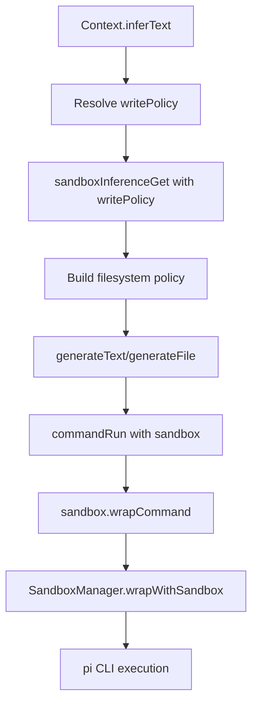

# Inference Sandbox

Inference commands execute inside a per-call sandbox policy built at `inferText` time.

## Policy

- Library: `@anthropic-ai/sandbox-runtime`
- Network: unrestricted by sandbox (no `network` section configured)
- Filesystem writes are dynamic per call:
  - `read-only`: no writable paths
  - `write-whitelist`: only explicitly listed paths
- Provider auth state is always writable:
  - `~/.pi`
- Sensitive host paths are denied for both read and write

## Sequence

## Notes

- Inference always runs sandboxed.
- The model runs in pi yolo mode; filesystem limits are still enforced by the outer sandbox.
- Prompt guards describe read-only behavior or an explicit write whitelist.
