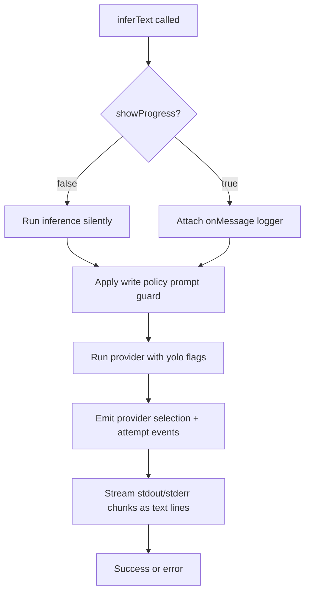

# Inference Visibility

Inference now supports a per-call visibility flag on `inferText`:

- `showProgress: true`

When enabled, the flow prints text-only progress messages to the terminal, including provider selection, attempt start/exit, and streamed stdout/stderr lines.
Inference is always sandboxed and always runs providers with yolo permissions flags.

## Flow

## Bootstrap Usage

`bootstrap` enables this flag for README and commit message generation so long-running calls are visible before timeout.
Before README inference, bootstrap checks out the source repository into `.beer/local/original` and passes that path in the prompt as read-only context.
