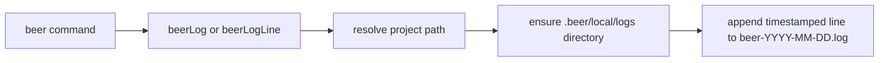

# Log File Output

Application logs now write to `.beer/local/logs/beer-YYYY-MM-DD.log` instead of stdout.

## Flow

## Notes

- Terminal output stays focused on interactive prompts and user-facing interactions.
- Inference progress messages are now file-logged through `beerLogLine`.
- Release command subprocess stdout/stderr is file-logged instead of streamed to screen.
