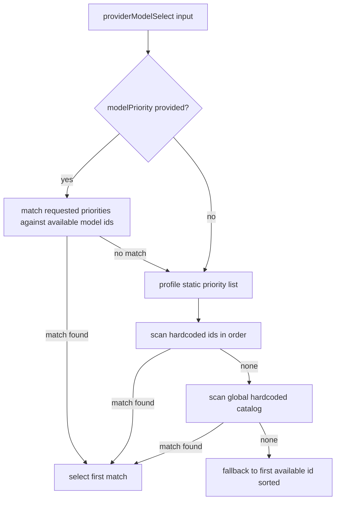

# Model Selector Static Priority

Model selection now relies on hardcoded model ids and static per-profile priority lists, then cross-checks them against provider-reported available models.

## Flow

## Notes

- Profiles: `sonnet`, `opus`, `codex-high`, `codex-xhigh`.
- Static model ids are sourced from known provider catalog entries and checked against real availability.
