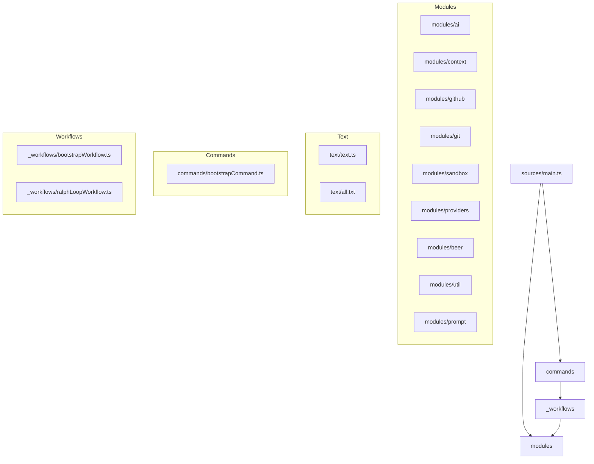

# Modules And Workflows Separation

The source tree is now split into core modules and workflow orchestration.

## Structure

## Intent

- `modules/*`: reusable, non-workflow capabilities (inference, context, integrations, utilities).
- `commands/*`: CLI command definitions and argument handling.
- `_workflows/*`: workflow orchestration (`bootstrap`, `ralph-loop`, and step coordination).
