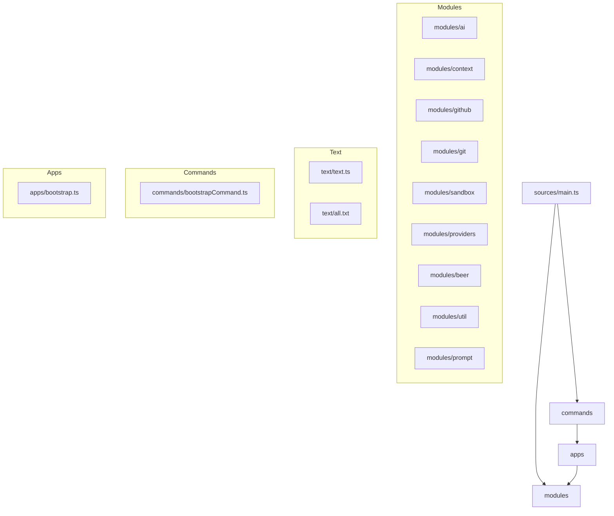

# Modules And Apps Separation

The source tree is now split into core modules and workflow apps.

## Structure

## Intent

- `modules/*`: reusable, non-workflow capabilities (inference, context, integrations, utilities).
- `commands/*`: CLI command definitions and argument handling.
- `apps/*`: workflow orchestration (bootstrap flow and its step coordination).
