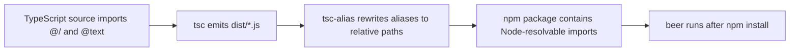

# npm Runtime Alias Fix

Fixes `ERR_MODULE_NOT_FOUND` after global npm install where Node could not resolve
TypeScript path aliases like `@/` and `@text` from emitted `dist/*.js`.

## Root Cause

- The build used `tsc` only.
- `tsc` preserves non-relative import specifiers (`@/...`) in emitted JS.
- Node ESM runtime does not understand this alias syntax in published packages.

## Build Update

- Added `tsc-alias` as a dev dependency.
- Updated `build` script to rewrite compiled alias imports after `tsc`.

