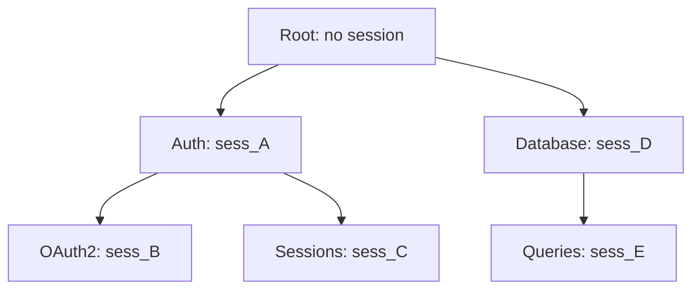
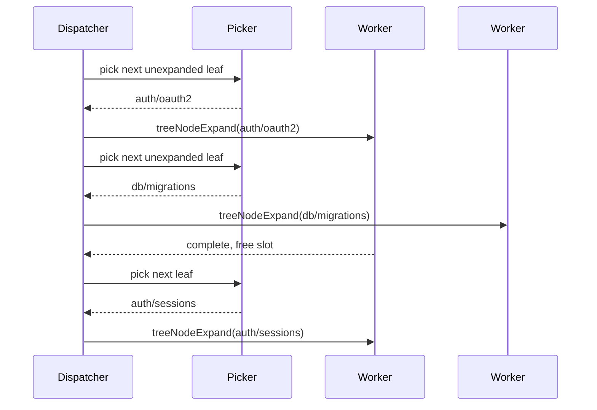

# Persisted Tree Search Harness

This document describes the tree-search harness implemented in `sources/modules/tree/`.

## Summary

The harness performs tree expansion in two phases:

1. Root walk: generate root children and expand all level-1 nodes (bounded by `concurrency` and `maxDepth`).
2. Guided search: repeatedly pick one unexpanded leaf via LLM, mark it `in-progress`, and expand it.

The system is persisted and resumable via:

- `children.json` at root and every non-root node
- `node.json` at every non-root node
- `document.md` at every non-root node

## Overall Flow

```mermaid
flowchart TD
  A[treeSearchRun] --> B[Ensure root dir]
  B --> C{root children.json exists?}
  C -- no --> D[generateText rootPrompt]
  D --> E[parse children + write root children.json]
  C -- yes --> E2[load cached root children]
  E --> F[create level-1 node.json files]
  E2 --> F
  F --> G[Phase 1: expand all level-1 nodes with concurrency]
  G --> H[Phase 2: picker loop]
  H --> I[treeLeafPick reads+renders full state]
  I --> J{picked leaf?}
  J -- no --> K[wait for in-flight jobs]
  K --> L[finish]
  J -- yes --> M{depth >= maxDepth?}
  M -- yes --> N[mark leaf + children=[]]
  M -- no --> O[mark in-progress]
  O --> P[dispatch treeNodeExpand]
  P --> H
```

## Session Forking

Each node expansion uses exactly one session for two calls (document then children). Child expansions fork from the parent's persisted `sessionId`.



## Dispatcher Concurrency Model



## Configuration

`TreeSearchConfig`:

- `rootDir`: absolute or project-resolved root tree directory.
- `rootPrompt`: prompt used to generate root-level children.
- `concurrency` (default `4`): max simultaneous expansion jobs.
- `maxDepth` (default `4`): node depth cutoff; nodes at/above cutoff are marked `leaf`.
- `modelSelectionMode`: provider model selection mode for all inference calls.
- `frontmatterSchema`: optional Zod schema validated against generated `document.md` frontmatter.
- `documentPrompt(node)`: prompt builder for node documents.
- `childrenPrompt(node)`: prompt builder for node child generation.
- `pickerPrompt(treeOutline, leaves)`: optional override for picker prompt.

## Filesystem Layout

```text
<root-dir>/
  children.json
  topic-a/
    node.json
    document.md
    children.json
    subtopic-1/
      node.json
      document.md
      children.json
  topic-b/
    node.json
    document.md
    children.json
```

## Status Model

`node.json.status` transitions:

- `unexpanded` -> `in-progress` -> `expanded`
- `unexpanded` -> `in-progress` -> `leaf`
- cached/replayed nodes remain `expanded` or `leaf`

`treeNodeExpand` skips inference only when node already has persisted `document.md` and `children.json` and status indicates completion.
