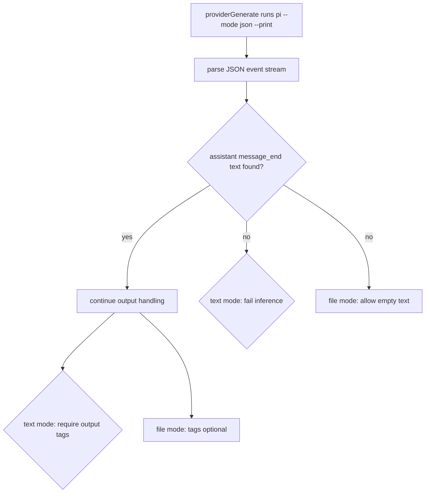

# Pi JSON Output Strictness

Inference output parsing now enforces JSON assistant output for text mode.

## Flow

## Notes

- Removed raw-stdout fallback when JSON assistant output is missing.
- Text generation now fails fast on malformed/non-assistant JSON output.
- File generation keeps optional textual confirmation behavior.
