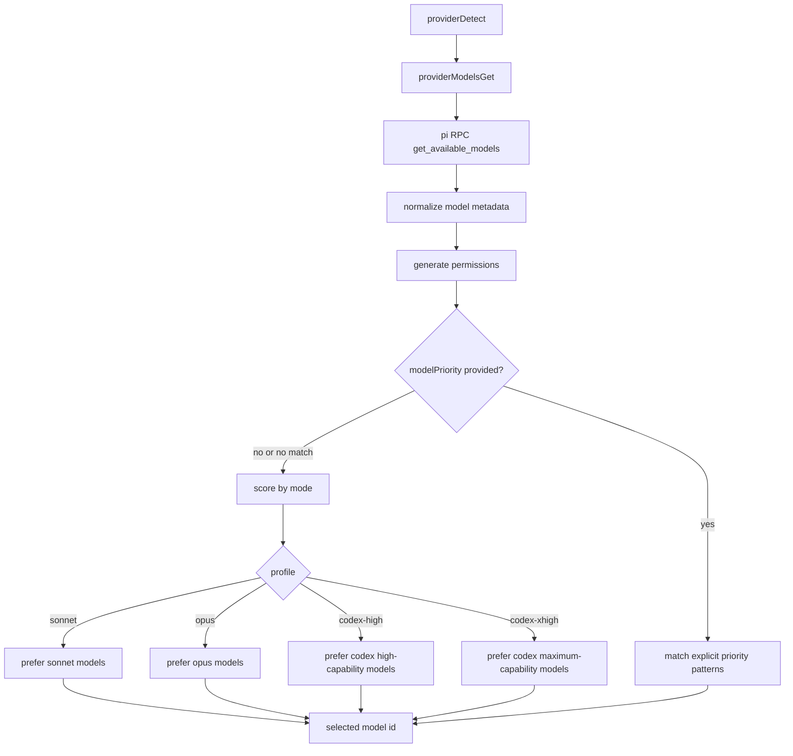

# Pi Model Selection Profiles

Model selection now uses live model metadata from `pi` RPC and a profile-based scorer.

## Flow

## Notes

- `generateReadme` uses `modelSelectionMode: "sonnet"`.
- `generateCommit` uses `modelSelectionMode: "codex-high"`.
- Explicit `modelPriority` still works and takes precedence.
