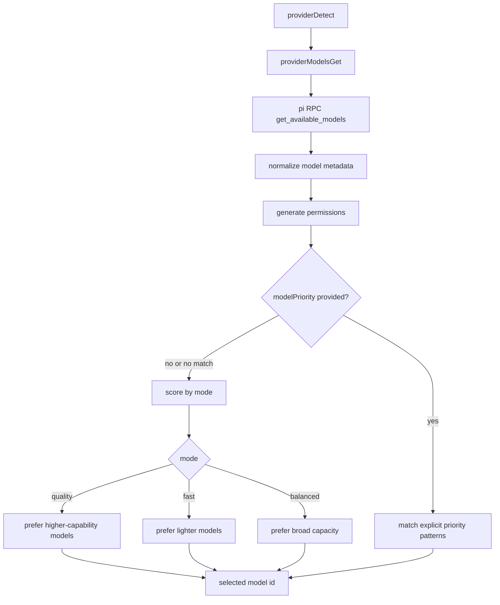

# Pi Model Selection Modes

Model selection now uses live model metadata from `pi` RPC and a mode-based scorer.

## Flow

## Notes

- `aiReadmeGenerate` uses `modelSelectionMode: "quality"`.
- `generateCommitMessage` uses `modelSelectionMode: "fast"`.
- Explicit `modelPriority` still works and takes precedence.
