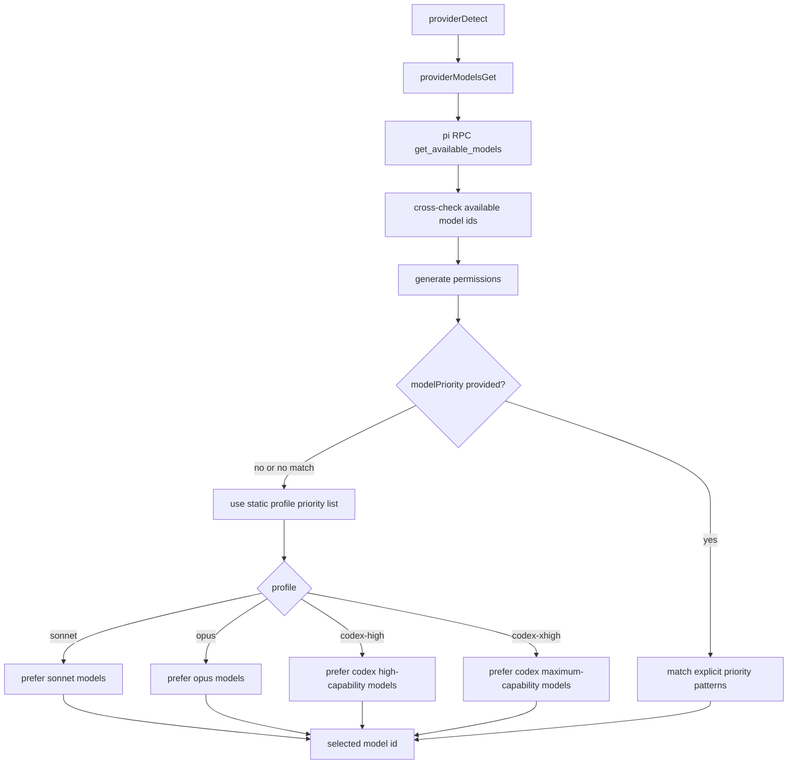

# Pi Model Selection Profiles

Model selection now uses hardcoded static model priority lists and picks the first available model for each profile.

## Flow

## Notes

- `generateReadme` uses `modelSelectionMode: "sonnet"`.
- `generateCommit` uses `modelSelectionMode: "codex-high"`.
- Explicit `modelPriority` still works and takes precedence.
- When no profile candidate is available, selection falls back to the first available model from the static global catalog.
