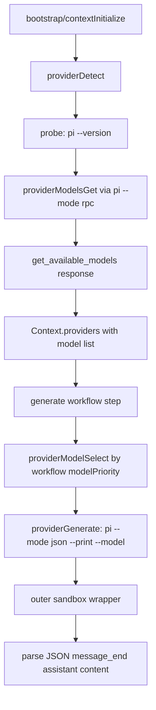

# Pi Provider And Model Resolution

This change replaces legacy direct provider execution with a single `pi` provider.

## Notes

- Provider detection now stores normalized model identifiers in `provider/models` format.
- Workflows provide ordered `modelPriority` lists and resolve against live available models.
- Inference runs in pi JSON mode; verbose output prints raw JSON event lines through existing progress logging.
- Sandbox auth write allowance now targets `~/.pi`.
