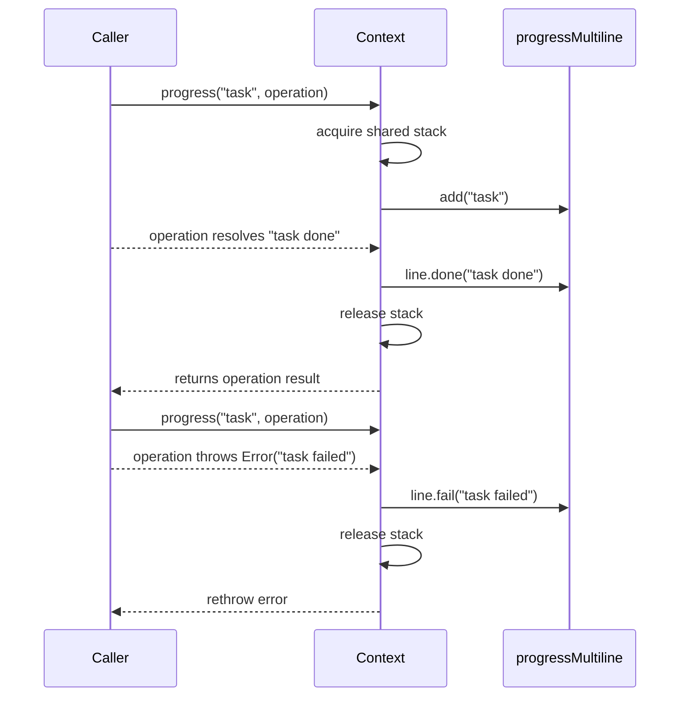

# Stackable Multiline Progress

Progress rendering now stacks automatically across concurrent `ctx.progress(...)` calls and does not require any separate multiline API.

## Flow

## Behavior

- Status symbols are now `✔` for success and `❌` for failure.
- Success line message is auto-derived when the operation result is a non-empty string.
- Failure line message is auto-derived from `Error.message` (or thrown string when used).
