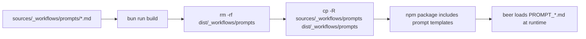

# Prompt Assets in npm Builds

Fixes runtime startup errors after npm install where prompt markdown files were
missing from `dist/_workflows/prompts`.

## Root Cause

- Workflow steps load prompt templates from disk at runtime using paths under
  `dist/_workflows/prompts`.
- TypeScript compilation emits JS but does not copy markdown assets.
- npm package shipped `dist` without prompt files.

## Build Fix

- Extended package `build` script to copy prompt assets:
  - remove stale `dist/_workflows/prompts`
  - copy `sources/_workflows/prompts` to `dist/_workflows/prompts`

